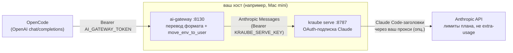

<div align="center">

# 🤖 Claude в OpenCode по подписке

**Opus 5.5 / Sonnet 5.5 / Haiku 4.5 в OpenCode — по вашему Plan Pro/Max, без API-ключей и оплаты за токены**

[](LICENSE)
[](https://github.com/Mobiss11/opencode-claude-subscription/actions/workflows/checks.yml)
[](https://github.com/Mobiss11/ai-gateway)

Один `install.sh` — и OpenCode через вашу подписку Claude отвечает моделями
Anthropic. Никаких ключей от API, никаких счетов за токены: лимиты плана,
prompt cache (~0.1x за повторяющийся префикс) и защита от классификации
«third-party app», которая иначе роняет каждый запрос OpenCode с 400.

</div>



## Почему это не «просто прокси»

OpenCode из коробки с подпиской Claude **не работает**. Причина найдена и
зафиксирована живыми пробами ([docs/third-party-app-400.md](docs/third-party-app-400.md)):

1. OpenCode говорит на OpenAI API, а подписка — это Anthropic Messages;
2. Anthropic классифицирует запросы сторонних агентных клиентов как
   «third-party app»: тарификация через extra-usage кредиты, без кредитов —
   детерминированный **400** на каждый запрос;
3. триггер классификации — env-секция OpenCode в system-промпте
   (`Today's date` + интро + `<env>…</env>`), а не «агентная идентичность».

Решение — перенос env-секции из system в первое user-сообщение
(`move_env_to_user` в [ai-gateway](https://github.com/Mobiss11/ai-gateway)):
модель контекст не теряет, классификация не срабатывает, запросы идут по
лимитам плана.

## Что вы получаете

| | |
| --- | --- |
| 💰 Подписка вместо токенов | Opus/Sonnet/Haiku по плану Pro/Max, prompt cache экономит окно |
| 🔌 Один endpoint | OpenAI-совместимый `:8130` — OpenCode и любые OpenAI-клиенты |
| 🔐 Секреты на месте | OAuth-credentials не покидают хост; наружу — один токен шлюза |
| 🧠 Reasoning | варианты `none/low/medium/high/xhigh/max` → `thinking.budget_tokens` |
| 🛡️ Регрессия под контролем | `verify.sh` воспроизводит исторический сценарий падения |
| ♻️ Управляемость | launchd-агенты, KeepAlive, идемпотентный install, ротация токена одной правкой |

## Состав

| Компонент | Роль | Где |
| --- | --- | --- |
| [`ai-gateway`](https://github.com/Mobiss11/ai-gateway) | движок: OpenAI ↔ Anthropic-мост, `move_env_to_user`, кэш | хост, `:8130` |
| [kraube serve](https://github.com/scott-walker/kraube-api) | OAuth-подписка Claude → Messages API | хост, loopback `:8787` |
| SSH-SOCKS-туннель *(опционально)* | egress Claude-трафика через выделенный сервер | хост, loopback `:1080` |
| OpenCode | клиент: провайдер `openai-compatible` | любая машина в LAN/tailnet |

Этот репозиторий — обвязка: сквозная установка, шаблоны, провайдер для
OpenCode и документация граблей. Движок не дублируется — ставится с
GitHub, рассинхрона нет.

## Установка

На macOS-хосте (у автора — Mac mini в Tailscale):

```bash
git clone https://github.com/Mobiss11/opencode-claude-subscription.git
cd opencode-claude-subscription
./install.sh
```

Что делает скрипт (идемпотентно, существующее не трогает без `--force`):

1. клонирует [ai-gateway](https://github.com/Mobiss11/ai-gateway) и ставит
   окружение (`uv sync`);
2. создаёт `~/.config/ai-gateway/{config.json,env}` с **сгенерированными**
   токенами (права `0600`);
3. собирает kraube из исходников (с патчем версии CC-заголовков) — или
   использует готовый бинарь (`--skip-kraube`);
4. ставит LaunchAgents (шлюз, kraube) и ждёт healthz.

Единственный интерактивный шаг — `kraube login` (URL в браузер, код в CLI),
скрипт сам подскажет момент. Туннель (если нужен отдельный egress-IP) —
руками по шаблону `deploy/com.alluc.kraube-proxy-tunnel.plist.example` из
репозитория шлюза.

<details>
<summary>Флаги install.sh</summary>

```text
--check         только проверить зависимости
--skip-kraube   шлюз и конфиги; kraube уже установлен отдельно
--force         перезаписывать существующие конфиги (с бэкапом)
INSTALL_DIR=~/ai-gateway KRAUBE_SRC_DIR=~/src/kraube-api ./install.sh
```
</details>

## Подключение OpenCode

Возьмите [config/opencode.provider.example.json](config/opencode.provider.example.json),
подставьте `baseURL` хоста и токен (`AI_GATEWAY_TOKEN` из
`~/.config/ai-gateway/env`) и влейте в `~/.config/opencode/opencode.json`:

```bash
python3 - <<'PY'
import json, pathlib
p = pathlib.Path.home() / ".config/opencode/opencode.json"
cfg = json.loads(p.read_text())
frag = json.loads(pathlib.Path("config/opencode.provider.example.json").read_text())
cfg["providers"].update(frag)
p.write_text(json.dumps(cfg, indent=2, ensure_ascii=False) + "\n")
PY
```

Использование:

```bash
opencode run -m homelab/claude-opus-5-5 "задача"
opencode run -m homelab/claude-opus-5-5#high "задача"   # reasoning-effort
```

## Проверка

```bash
./verify.sh                     # на хосте (http://127.0.0.1:8130)
./verify.sh http://mini:8130    # с клиентской машины
```

Четыре сценария: healthz, только-Claude модели, обычный запрос и —
ключевой — **OpenCode-стиль system с env-секцией** (историческое падение).
`4/4 PASS` — стек жив.

## Структура

```
install.sh                          # сквозная установка на хост
verify.sh                           # проверка деплоя (4 сценария)
config/
  gateway.config.example.json       # конфиг шлюза: kraube + move_env_to_user
  gateway.env.example               # AI_GATEWAY_TOKEN, KRAUBE_SERVE_KEY
  opencode.provider.example.json    # провайдер homelab для OpenCode
docs/
  architecture.md                   # схема, порты, файлы, ротация/откат
  third-party-app-400.md            # диагноз: дифференциальные пробы, фикс
```

## FAQ

**Это законно?** Использование собственной подписки из сторонних клиентов —
серая зона, Anthropic обкладывает её классификацией «third-party app»
(extra-usage кредиты). Стек честно обходит триггер классификации на уровне
формата запроса; политика может измениться — пробами из
[docs](docs/third-party-app-400.md) легко проверить актуальное поведение.

**Чем это лучше claude-code-proxy и подобных?** Переводом уровня протокола
(streaming, tool-calls, thinking), prompt cache с честным usage,
каталогом моделей и регрессионным тестом на исторический 400 — плюс
решение проблемы third-party-классификации, а не только маппинг эндпоинтов.

**Подойдёт для Cursor/других OpenAI-клиентов?** Да: шлюз — обычный
OpenAI-compatible endpoint; OpenCode здесь просто основной клиент.

**Нужен ли Mac mini?** Нет, любой macOS-хост, который видят клиенты
(LAN/Tailscale). Шлюз — Python 3.13+.

**Сменится политика Anthropic?** Возможен возврат 400 — прогоните
дифференциальные пробы (шаблоны в docs) и обновите фикс; сценарий
падения ловит `verify.sh`.

## Эксплуатация

- Подписка: Pro/Max; лимиты общие для Claude Code и этого стека.
- kraube владеет refresh-токеном единолично: пока `serve` запущен, не
  запускайте `kraube login`/`kraube query`.
- Отладка: `AI_GATEWAY_DUMP_REQUESTS=/tmp/dir` в окружении шлюза.
- Логи: `~/ai-gateway/logs/`, `~/Library/Logs/kraube-serve.*.log`.
- Ротация токена и откат — в [docs/architecture.md](docs/architecture.md).

## Лицензия

MIT — см. [LICENSE](LICENSE). Движок — [ai-gateway](https://github.com/Mobiss11/ai-gateway) (MIT);
kraube — сторонний проект [scott-walker/kraube-api](https://github.com/scott-walker/kraube-api).
